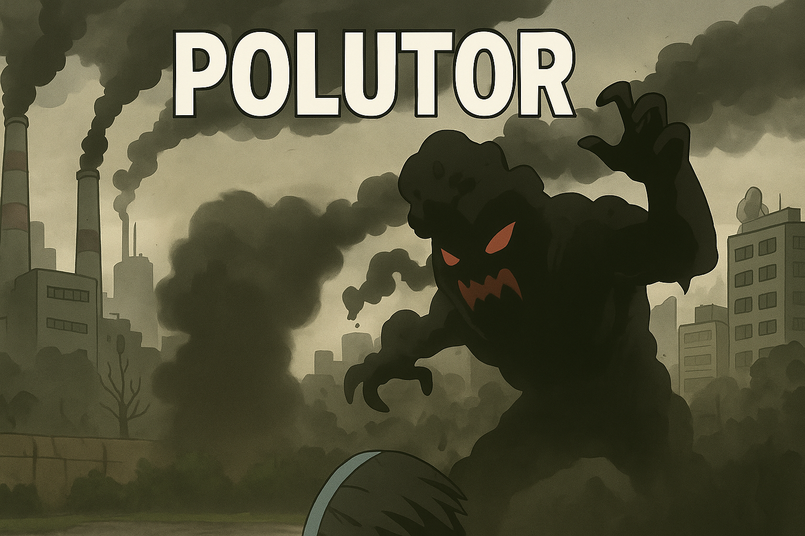
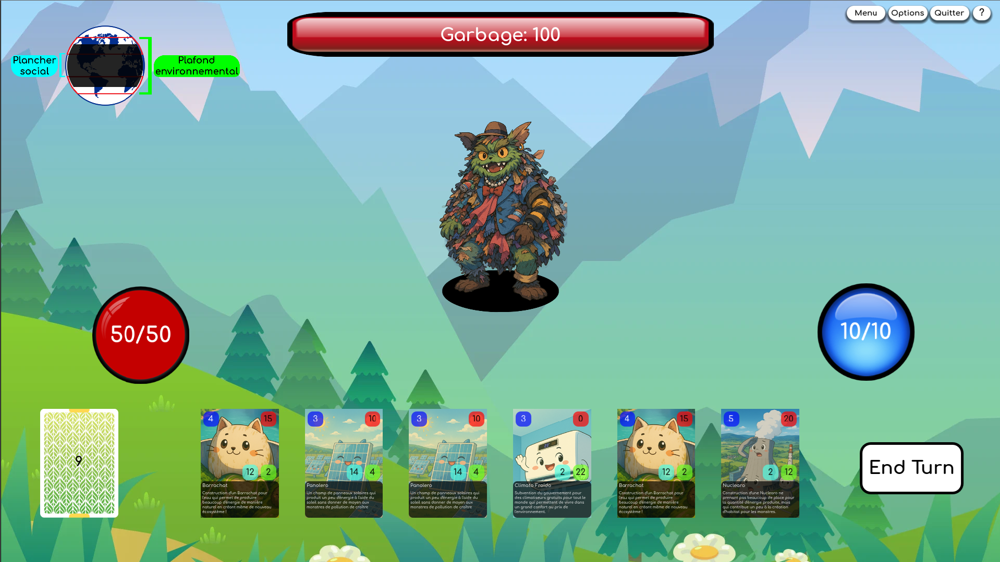

# 

/!\ Ceci est un projet en cours de développement /!\

Lien de téléchargement du jeu : [itch.io](https://tatsumakyy.itch.io/polutor)

- Installez le fichier en fonction de votre OS (Windows et MacOS disponible uniquement)
- Windows : Lancez le fichier polutor.exe
- MacOS : Extraire les fichiers à l'endroit de votre choix, lancer le fichier Polutor. S'il n'est pas possible d'ouvrir le fichier Polutor, rendez-vous dans vos paramètres MacOS de Confidentialité et Sécurité pour "Ouvrir quand même" le fichier Polutor.

## Présentation du jeu et inspiration

Polutor est un jeu de carte inspiré de [Slay the Spire](https://store.steampowered.com/app/646570/Slay_the_Spire/) et [Daybreak](https://www.daybreakgame.org/). Ce jeu est développé sur [Godot Engine](https://godotengine.org/). C'est un tour par tour où vous piochez deux cartes à chaque début de tour. Le but est de venir à bout des monstres apparus à cause de la pollution en utilisant votre deck de cartes déjà fait pour non seulement réduire à 0 les points de vie du monstre, mais également de gérer une jauge environnementale et sociale sous forme de rond/donut pour qu'elle reste dans un certain équilibre. Cette jauge change en fonction des cartes jouées qui ont toutes une influence sociale et environnementale. Si après avoir tué le monstre cette jauge n'est pas en équilibre, cela donne de gros bonus au prochain monstre, ce qui va rendre le combat beaucoup plus difficile.

### Contexte de développement

Ce jeu est réalisé par Sébastien Franzone dans le cadre d'un projet de semestre du Master d'Informatique pour Sciences Humaines de l'Université de Lausanne avec M. Isaac Pante comme superviseur et M. Yannick Rochat comme expert.

### Exemple de scène de combat

## Médiation

Polutor a pour objectif de sensibiliser les gens aux difficultés du monde moderne dans lequel on vit liées à la pollution et aux énergies (principalement l'électricité dans notre cas). Il n'est pas si facile de vouloir réduire la pollution dans le monde surtout dans les pays développés, car les gens ne veulent pas perdre leur confort si bien établit qui repose sur une grosse production d'énergie de la manière la plus efficace possible, mais pas la plus écologique parfois. Il est compliqué de, par exemple, remplacer une centrale nucléaire (pour réduire les déchets nucléaires) par des champs d'éolienne, car la production d'une éolienne est beaucoup moins élevée. D'après [cet article](https://www.energyscope.ch/fr/questions/combien-faut-il-deoliennes-pour-remplacer-une-centrale-nucleaire/) tiré du site [eneryscope.ch](www.energyscope.ch/fr), il est dit qu'il faudrait environ 700 éoliennes pour remplacer une centrale nucléaire comme celle de Mühleberg dans le canton de Berne en Suisse qui produit seulement 10% de la totalité de la puissance du parc nucléaire de la Suisse. Ce n'est donc pas qu'au travers de remplacement de centrales diverses qu'il faut regarder pour réduire la pollution. Certaine lois sont/pourraient être instaurées pour que tout un chacun puisse contribuer au bien-être de la planète tout en pouvant garder un minimum de confort. C'est là toute la problématique d'un document de l'UNIL intitulé le [Donut de l'UNIL](https://www.unil.ch/unil/fr/home/menuinst/universite/organisation-universite/unites-et-services/centre-de-competence-en-durabilite/articles-et-rapports/le-donut-de-l-unil.html) où, à l'aide de l'image d'un donut, il est expliqué les différents enjeux liés à la pollution et à sa réduction. Cet article utilise l'image d'un donut pour montrer qu'il existe un plafond environnemental et un plancher social qui sont deux limites planétaires qui auraient un impact significatif si elles sont dépassées. Si le plafond environnemental est franchi, cela aurait un impact écologique très important, comme nous le vivons déjà avec les changements climatiques, mais que si le plancher social, à l'inverse, venait à être franchi, cela aurait un impact sur l'humain, car nous serions privés de beaucoup de choses qui nous permettent d'avoir le confort que nous avons dans les pays développés comme par exemple la médecine ou l'éducation qui ne pourraient pas être aussi efficace sans la technologie, du coup de l'énergie dépensée, dont nous disposons aujourd'hui.

## Game Design

### Le "Donut"
Polutor est, comme déjà rapidement évoqué dans la présentation du jeu, basé sur des cartes qui peuvent être jouées pour détruire le monstre nous faisant face. Ces cartes ont une influence sociale et une influence environnementale indiquées par des chiffres qui iront modifier la jauge ronde représentée par la terre avec des zones délimitées. Ceci est une forme pour représenter le donut et ainsi il ne s'agira pas de simplement faire des dégâts au monstre, mais également de prendre en compte l'impact que chaque carte peut avoir sur le monde.

### Les cartes

Il y a, dans la version actuelle, 10 cartes différentes dans le deck de base avec plusieurs exemplaires pour certaines cartes. Chaque carte représente, sous forme animalière, une action que le joueur entreprend pour combattre le monstre. Ces actions peuvent être des constructions de structures permettant une meilleure production d'énergie pour de plus gros dégâts au monstre ou des mises en place de lois avec moins de dégâts, mais plus d'influence environnementale ou sociale. Les cartes ont également un coût en mana pour être limité dans les actions par tour et devoir utiliser chacune d'entre elles intelligemment.

## Assets

### Musiques

Les musiques et effets sonores de ce projet ont été téléchargées depuis [pixabay.com](https://pixabay.com/music/) et sont toutes sans copyright.

### Images sans droits d'auteur

Trois images en libre accès ont été utilisées dans ce projet sans avoir été générées par des intelligences artificielles, ce sont l'image fond du menu principal et les deux images de fond des deux combats qui sont tirée de [opengameart.org](https://opengameart.org/content/simple-nature-pixel-background-for-video-game) et de [John Paul](https://polonaise.artstation.com/projects/RYaN1r).

Les images d'interface sont des images sans droits d'auteur récupérées sur [Google Image](https://www.google.com/imghp?hl=en&authuser=1&ogbl)

## Intelligences Artificiels (ChatGPT)

Durant ce projet, une seule intelligence artificielle, [ChatGPT](https://chatgpt.com/), a été utilisée. La principale fonction pour laquelle elle a été utilisée est la correction de code. En précisant le type de langage que c'est, il est très facile de demander où se situe une erreur ou comment la corriger en demandant simplement à ChatGPT et en lui envoyant le code. ChatGPT a également été sollicité, mais cette fois-ci que de manière minimale pour la rédaction du code. En effet, il est difficile d'utiliser ChatGPT pour la rédaction de code dans un programme comme Godot avec un langage spécifique à lui-même, c'est pourquoi il a été utilisé que de manière minimale.
Le deuxième aspect pour lequel ChatGPT a été utilisé est la génération d'images. En effet, cela a permis de gagner du temps et d'avoir une forme d'unification dans le thème général de mes images pour les cartes et l'image de couverture itch.io et du read.me. Les 10 images de cartes ont été générées en envoyant une requête similaire à ChatGPT pour générer des images dans le même style.

## Possibilités futures

Il y a plusieurs possibilités pour étendre ce jeu en implémentant de nouvelles fonctions. Voici une liste des aspects qui pourraient être implémenté dans de futures versions du jeu :
- Plus de cartes : Augmenter la base de données de cartes pour diversifier les façons de battre le boss en restant dans la zone saine du Donut
- Plus de monstres : Ajouter de nouveaux monstres avec différentes attaques avec des effets supplémentaires pour rallonger la durée de vie du jeu.
- Deck building : Avec une augmentation de la base de données des cartes et d'augmentation et variation des monstres, il serait intéressant d'implémenté un système de deck building où le joueur peut changer son deck à chaque combat
- Plus grandes storylines : Créer une histoire plus détaillée et étendue pour une plus grande immersion du joueur dans le jeu

## Bugs connus

- Le zoom sur les cartes ne se fait plus après le tutoriel (qu'il soit fait au complet ou passé)
- Cartes légèrement floutées quand on zoom dessus
- Les cartes apparaissent au-dessus de tout le reste et peuvent empêcher certaines actions dans les options